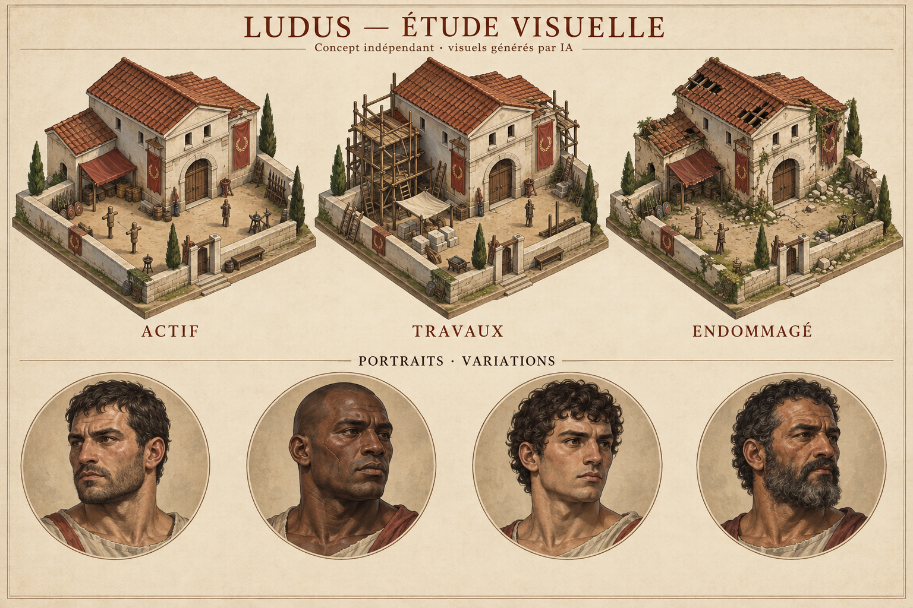

# Ludus — étude visuelle indépendante

Ébauche de direction artistique pour un jeu de gestion d’école de gladiateurs : un bâtiment sous trois états et quatre portraits distincts. Visuels générés par IA, examinés et sélectionnés comme proposition de style. Ce document est une planche conceptuelle, pas une capture d’un jeu fonctionnel ni des sprites détourés prêts à intégrer.

Piste technique : bâtiments isométriques 2D aux dimensions et points d’ancrage stables, portraits indexés par identifiant et visualisation des événements de combat séparée des règles de jeu. Le moteur existant et le schéma des événements doivent être connus avant intégration. Les règles de combat appartiennent au jeu du client ; une nouvelle simulation nécessiterait des règles convenues.

La production finale dépend de la validation du style, du nombre d’assets, des tailles et de l’accord sur l’utilisation d’images générées. Aucune affiliation ni réalisation client antérieure revendiquée.

CDRXRX · Cédric Roux
